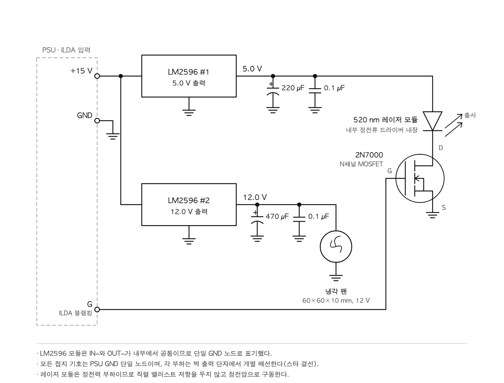
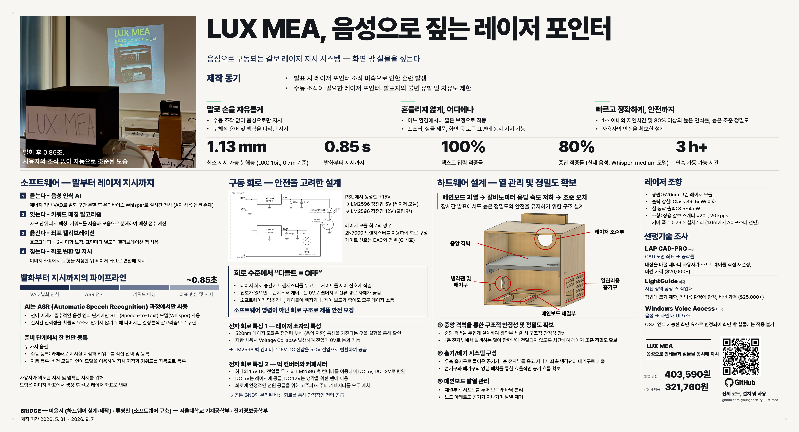

<div align="center">

<h1>LUX MEA</h1>

**말하면, 레이저가 짚어준다.**

발표자가 부위 이름을 말하면 갈바노미터 스캐너가 레이저를 그 지점으로 보낸다.
화면 속 픽셀이 아니라 인쇄 포스터·회로기판·실물 장비를 짚는다.

[](LICENSE)
[](https://www.python.org/)
[-000000.svg?logo=apple&logoColor=white)](#설치)
[](#성능)
[](https://github.com/Grix/helios_dac)
[](#안전)
[](#성능)
[](#성능)

[English](README.md) · **한국어**

[왜](#왜-만들었나) · [동작 원리](#동작-원리) · [설치](#설치) · [사용](#사용) · [성능](#성능) · [안전](#안전) · [포스터](#포스터) · [팀](#팀)

</div>

<p align="center">
  
</p>

<p align="center"><i>발화 후 0.85초, 사용자의 조작 없이 자동으로 조준된 모습.</i></p>

---

## 한눈에

- **말로 짚는다.** 들 포인터도, 끌 커서도, 들어올릴 팔도 없다.
- **거리를 가리지 않는다.** 시준광이라 어느 거리에서나 초점이 맞는다. 벽에 붙은
  포스터와 책상 위 기판을 **하나의 빔이** 문장 도중에 오간다 — 초점 조절 없이.
- **최소 지시 분해능 1.13 mm** (0.7 m 기준, DAC 1 LSB), **발화부터 지시까지 0.85초.**
- **신경망은 딱 한 곳에만.** 음성→텍스트만 Whisper가 하고, 그 뒤는 전부 결정론이다.
  관객 앞에서 예측 가능하게 동작해야 하는 구간이기 때문이다.
- **오프라인 동작.** 기본은 온디바이스 ASR. 클라우드는 선택지일 뿐 의존성이 아니다.
- **안전은 소프트웨어가 아니라 회로가 보장한다.** 상한은 Class 3R 정격 모듈과 정전압
  레일이 정하고, 제어 신호가 능동적으로 켜지 않는 한 빔은 꺼져 있다.
- **부품비 약 403,590원.** 같은 방식으로 빔을 조향하는 산업용 레이저 프로젝터는
  2천만 원부터 시작한다.

---

## 왜 만들었나

발표 중 실물을 손으로 짚는 일은 생각만큼 잘 되지 않는다. 객석 측면에서 보면 손끝은
전혀 다른 곳을 가리키고, 부품이 빽빽한 기판에서는 몇 밀리미터가 다른 소자다. 레이저
포인터는 한 손을 묶고 흔들린다. 카메라로 확대해 보여주면 관객의 시선이 실물에서
떠난다.

정확히 짚는 데 필요한 정보는 **이미 발표자의 문장 안에 있다.** LUX MEA는 그 발화
자체를 지시 명령으로 쓴다. 두 손이 자유로워지고, 팔을 편하게 들 수 없는 발표자도
쓸 수 있다.

### 선행기술 조사

| | 입력 | 대상 | 가격 |
|---|---|---|---|
| **LAP CAD-PRO** (독일) | CAD 도면 좌표 | 공작물 | $20,000+ |
| **LightGuide** (미국) | 사전 정의된 공정 | 고정된 작업대 | $25,000+ |
| **Windows Voice Access** (미국) | 음성 | 화면 내 UI 요소 한정 | — |
| **LUX MEA** | 음성 | 등록된 모든 실물 표면 | **403,590원** |

산업용 레이저 프로젝터는 정확히 같은 원리로 빔을 조향하지만, 입력이 CAD이고 대상을
바꾸려면 사용자가 소프트웨어를 직접 재설정해야 하며 공장 단가로 매겨져 있다. 음성
제어도 이미 있지만 화면 경계에서 멈춘다. LUX MEA는 **같은 조향 원리에 음성을 입력으로
얹어, 화면 밖 물리 세계를 향하게 한 것**이다. 노트북 한 대 값으로.

---

## 동작 원리

```
마이크 ─▶ VAD ─▶ Whisper ─▶ 매칭 ─▶ 도형 ─▶ 캘리브레이션 맵 ─▶ 갈보 ─▶ 레이저
                              │
                         parts.yaml
```

| 단계 | 하는 일 | 신경망? |
|---|---|---|
| **듣는다** | 에너지 기반 VAD로 마이크 스트림을 발화 단위로 분할 | X |
| **잇는다** | Whisper 온디바이스 전사, 부위 이름을 디코더 프롬프트로 주입 | **O — 유일** |
| **짚는다** | 한국어를 자모로 분해해 별칭 사전과 퍼지 매칭 | X |
| **옮긴다** | 이미지 좌표 → 갈보 각도 (캘리브레이션 맵) | X |
| **그린다** | 원 / 밑줄 / 십자선, 이동 구간은 블랭킹 | X |

**음성.** 에너지 기반 VAD가 마이크 스트림을 발화 단위로 자르고, Whisper가 온디바이스로
전사한다 — 네트워크 없음. 부위 이름을 디코더 프롬프트로 넣어주면 도메인 어휘 인식률이
눈에 띄게 올라간다.

**매칭.** 한국어를 자모 단위로 분해한 뒤 퍼지 매칭한다. 전사가 틀려도 자음이 남아
있으면 올바른 부위로 떨어진다. 후보 점수는 유사도만이 아니라 **매칭된 별칭 길이의 합**
으로 매긴다. 그렇게 하지 않으면 "전원" 같은 짧고 일반적인 별칭이 긴 문장 아무데나
걸려서, 정작 화자가 의도한 구체적인 부위를 이겨버린다.

**캘리브레이션.** 갈보는 각도 한 쌍만 받는다. 그래서 표면 위의 목표 위치를 각도로
변환해야 한다. 격자점을 투사해 착지 위치를 촬영하고, 호모그래피에 2차 다항식 보정을
더해 적합한다. 정확도는 적합에서 **제외한** 점으로 측정한다.

**렌더링.** 도형은 이미지 좌표계에서 생성한 뒤 점 단위로 변환한다. 갈보 좌표계에서
바로 그리면, 빔에 정면으로 놓이지 않은 표면에서 원이 타원이 된다.

**두 표면을 동시에.** 갈보는 한 번에 한 점만 보여주지만, 여러 도형을 충분히 빠르게
왕복하면 잔상으로 합쳐진다 — 도형 2개에서 100 Hz를 훨씬 넘는다. `parts.yaml`에서
`link:`로 묶인 부위는 함께 켜지므로, 기판 위 부품 이름을 부르면 포스터에서 그 부품을
설명하는 문단도 같이 표시된다. 이동 구간은 블랭킹해서 연결선이 생기지 않는다.

### 등록 — 발표 전에 한 번만

발표 중에는 비전 모델이 한 번도 돌지 않는다. 부위를 미리 등록해 **인식 문제를 조회
문제로 치환**했기 때문이다.

- **수동 등록** — 사진에서 지시할 지점을 클릭하고 키워드를 직접 입력한다.
- **자동 등록** — 비전 모델과 언어 모델(OCR·open-vocabulary detection)이 사진에서
  후보를 뽑고 사람이 검수한다. 런타임은 둘의 차이를 알지 못한다.

---

## 하드웨어

| | |
|---|---|
| 스캐너 | 상용 갈바노미터, ±20°, 20 kpps, 더블 바운스 |
| DAC | Helios Laser DAC (12 bit, ILDA) |
| 레이저 | 520 nm 그린 모듈, Class 3R, 정격 5 mW 이하, 실동작 3.5–4 mW |
| 커버리지 | 폭 ≈ 0.73 × 거리 — 1.6 m에서 A0 포스터 전면 |
| 전원 | ±15 V PSU → LM2596 벅 → 5 V(레이저) · 12 V(쿨링팬) |
| 블랭킹 | 레이저 전원 경로의 2N7000 MOSFET, 게이트는 DAC 색 채널(G) |
| 카메라 | 캘리브레이션·등록 시에만 사용, 시연 중에는 분리 |

<p align="center">
  
</p>

<p align="center"><i>구동 회로 — ±15 V 입력, LM2596 두 레일 출력, 5 V 쪽에 물린 블랭킹 트랜지스터</i></p>

### "디폴트 = OFF"는 회로의 성질이다

트랜지스터를 레이저 회로 중간에 두고 그 게이트를 제어 신호에 직결했다. 신호가 없으면
게이트가 0 V로 떨어지고 전류 경로가 물리적으로 끊긴다. 소프트웨어가 멈추거나, 케이블이
빠지거나, 제어 보드가 죽으면 레이저는 꺼진다 — 무언가가 끄기로 *판단해서*가 아니라,
더 이상 회로가 아니기 때문이다.

### 열 관리

메인보드가 과열되면 갈바노미터 응답 속도가 떨어지고, 응답 지연은 곧 조준 오차다.
케이스는 그 문제를 중심으로 설계했다. 두꺼운 **중앙 격벽**이 광학부를 떠받치면서 아래
전자부와 구조적으로 분리하고, 양측에 어긋나게 배치한 **흡기구와 배기구**가 전자부를
가로지르는 공기 흐름을 만들어 냉각팬으로 빼낸다. 메인보드는 서포트로 띄워 보드 아래로도
공기가 지나간다. **3시간 이상 연속 가동**을 검증했다.

---

## 설치

Apple Silicon + Python 3.12가 검증된 조합이다. `--sim`과 `--no-voice`는 하드웨어
없이 돌아간다.

```bash
git clone https://github.com/youngchan-ryu/lux_mea.git
cd lux_mea
python3 -m venv .venv && source .venv/bin/activate
pip install -r requirements.txt
```

하드웨어 실행에는 Helios DAC이 필요하다. `libHeliosLaserDAC.dylib`이 이 디렉토리에
함께 들어 있고 자동으로 잡히므로, 다른 곳에 두는 경우에만 `HELIOS_LIB`을 설정하면 된다.
`--engine groq`을 쓸 때만 `GROQ_API_KEY`가 추가로 필요하다.

## 사용

```bash
python3 test_match.py      # 하드웨어 불필요: 매칭과 link 검사
python3 app.py --sim       # 하드웨어 불필요: 창에 그리기
python3 app.py             # 실동작
```

`app.py --no-voice`는 음성 대신 숫자키로 조작한다. 촬영 중이거나 마이크를 믿기에
너무 시끄러운 환경에서 유용하다.

부스 운영용 GUI도 있다. 시연 사이사이에 플래그를 타이핑하고 싶은 사람은 없으니까.

```bash
python3 launcher.py
```

폴더에서 캘리브레이션·사전 파일을 찾아주고, 마지막 선택을 기억하고, 로그를 창에
흘려주고, SIGINT로 앱을 종료해 빔이 파킹된 채 빠져나가게 한다.

새 물체를 세팅하는 데는 네 단계 — 조준, 촬영, 적합, 등록 — 가 필요하고 그 결과가
`data/`를 채운다. 전 과정과 이 디렉토리의 모든 파일 설명은 **[MANIFEST.md](MANIFEST.md)**
에 있다.

### 코드와 데이터는 분리되어 있다

세션이 만들어내거나 소비하는 모든 것 — 촬영본, 캘리브레이션, 부위 사전, 로그 — 은
`data/`에 있고 추적되지 않는다. 갓 클론한 저장소에는 코드만 있고 캘리브레이션은 없다.
`LUXMEA_DATA`를 다른 곳으로 지정하면 시연 대상마다 폴더를 따로 둘 수 있다.

---

## 성능

| | |
|---|---|
| 발화 → 빔 조준 완료 | **0.85 s** (발화 종료 판정 0.35 s 포함) |
| 최소 지시 분해능 | **1.13 mm** @ 0.7 m (DAC 1 LSB) |
| 캘리브레이션 오차 (held-out) | ≈ DAC 1 LSB |
| 텍스트 입력 적중률 | **100%** |
| 실제 음성 종단 적중률 | **80%** (Whisper `medium`) |
| 도형 2개 리프레시 | > 100 Hz |
| 스캔 속도 | 20 kpps |
| 연속 가동 | 3시간+ |
| 레이저 등급 | 3R, 5 mW 미만 |
| 부품비 | **403,590원** (양산 시 321,760원) |

### 어떤 Whisper를 쓸 것인가

실제 발표 문장 녹음으로 Whisper 세 가지 크기를 비교했다. 평가 지표는 전사 정확도가
아니라 ***시스템이 옳은 곳을 짚었는가***다 — 매처가 ASR 오류를 상당 부분 흡수하므로
단어 단위 정확도는 잘못된 지표다.

| 모델 | 적중률 | 지연 시간(중앙값) |
|---|---|---|
| large-v3-turbo | 70% / 40% | 0.49 s |
| **medium** | **80% / 80%** | **0.38 s** |
| small | 60% / 70% | 0.14 s |

`medium`이 정확도와 일관성 양쪽에서 이겨 기본값이 되었다. 가장 큰 모델이 오히려 나쁘고
변동도 컸는데, 대부분 조용한 구간에서 같은 문구를 길게 반복하는 환각 때문이었다 — 지금은
잡음 바닥을 넘지 못한 구간은 아예 디코더로 보내지 않는다. 원본 출력은
[`bench_asr_result.md`](bench_asr_result.md)에 있고, `bench_asr.py`로 재실행할 수 있다.

위 내용은 전부 로컬 실행 기준이다. `--engine groq`은 오디오를 클라우드로 보낸다. 로컬
모델이 감당하기 어려울 만큼 시끄러운 환경을 위한 선택지이며, `GROQ_API_KEY`와 —
당연하게도 — 네트워크가 필요하다.

---

## 안전

출력 상한은 코드가 아니라 **부품과 회로가** 정한다. Class 3R 정격에 정전류 드라이버를
내장한 모듈을, 가변 전원이 아니라 LM2596 정전압 5.0 V 레일로 구동한다. 여기서 직렬
밸러스트 저항은 쓸 수 없다 — 그린 모듈이 정전력 부하라서 저항을 달면 전압이 0 V로
붕괴한다. 같은 전원 경로에 놓인 블랭킹 트랜지스터의 게이트는 DAC 색 채널에 물려 있어,
무언가가 능동적으로 켜지 않는 한 빔은 꺼져 있다. 신호가 없으면 전류 경로 자체가 없다.
그 위에 소프트웨어 펜스가 있어 모든 좌표는 DAC에 도달하기 전에 실측된 안전 영역
(`device.yaml`)으로 clamp된다. 소프트웨어 버그가 있어도 검증된 범위 밖으로 빔을 보낼 수
없다. 대기 중에는 빔을 덤프로 파킹한다.

> 소프트웨어만으로 안전을 보장하지 않는다. 하드웨어가 바닥을 받치고,
> 소프트웨어는 그 위에 정확도와 편의를 더한다.

---

## 한계

- 캘리브레이션 하나는 표면 하나다. 깊이나 기울기가 다르면 별도의 적합이 필요하다.
  경계에서 맵이 꺾이므로 호모그래피 하나로는 표현할 수 없다.
- 앵커는 등록 시점의 카메라 자세에 묶여 있다. 카메라를 옮기면 다시 등록해야 한다.
- 목업을 평면으로 취급한다. 그 평면에서 솟아 있는 부품은 대략 (높이 × tan(입사각))
  만큼 어긋난다.
- 등록은 사람이 클릭하는 작업이다. OCR과 검출이 후보를 제안할 수 있지만 사람이 검수
  하며, 발표 중에는 비전 관련 코드가 전혀 돌지 않는다.

## 로드맵

- [x] 갈보·레이저 구동, 하드웨어 블랭킹
- [x] 평면 캘리브레이션 (호모그래피 + 2차 다항)
- [x] 음성 인식 → 부위 매칭
- [x] 하나의 빔으로 이중 표면 (포스터 ↔ 실물)
- [x] 부스 운영 GUI, ASR 백엔드 전환
- [x] 520 nm 그린 레이저 (LM2596 벅 — 정전력 부하라 저항 구동 불가)
- [x] 능동 냉각, 3시간+ 검증
- [ ] 자동 등록 파이프라인을 GUI에 연결
- [ ] 마커 기반 상시 드리프트 감시
- [ ] 조립 가이드 모드 (장착 감지 → 다음 단계 지시)

---

## 포스터

제15회 서울대학교 공과대학 창의설계축전 전시작 · 2026년 9월 9~10일

<p align="center">
  <a href="docs/poster_kr.png"></a>
</p>

<p align="center">
  <a href="docs/poster_kr.png">원본 해상도</a> &nbsp;·&nbsp;
  <a href="docs/poster_en.png">English edition</a>
</p>

---

## 팀

**팀 BRIDGE** — 서울대학교 · 2026. 5. 31 ~ 2026. 9. 7

| | | |
|---|---|---|
| **이윤서** | 하드웨어 설계·제작 | 기계공학부 |
| **류영찬** | 소프트웨어 구축 · 구동 회로 | 전기정보공학부 |

## 참고문헌

- LAP GmbH, *CAD-PRO Laser Projector — Product Documentation*, 2024.
- IEC 60825-1:2014, *Safety of Laser Products — Part 1*.
- A. Radford et al., *Robust Speech Recognition via Large-Scale Weak
  Supervision*, arXiv:2212.04356, 2022.

## 라이선스

[MIT](LICENSE). 함께 포함된 Helios DAC 호스트 라이브러리는 Gitle Mikkelsen의
MIT 라이선스를 따른다 — [NOTICE](NOTICE) 참조.
