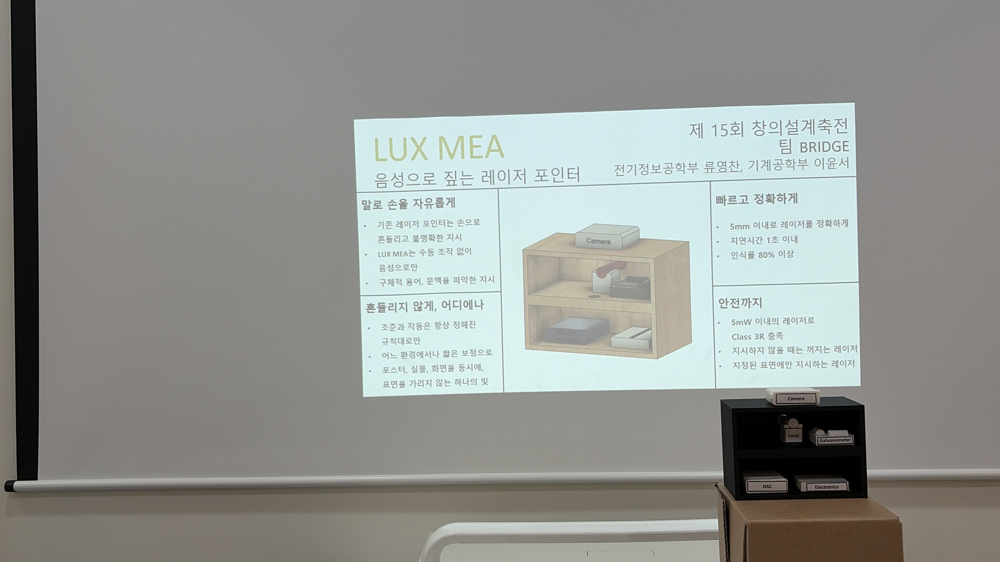

# LUX MEA

**A speech-driven laser pointer.** Say the name of a part and a galvanometer
scanner steers a laser onto it, drawing a circle, an underline, or a crosshair
around whatever you just mentioned.

Because a laser beam is collimated, it stays in focus at any distance. The same
beam can mark a printed poster on the wall and a circuit board on the desk in
front of it, and switch between them mid-sentence without refocusing.

Built for the 15th SNU College of Engineering Creative Design Festival by
**Team BRIDGE** — a two-person project, May–August 2026.

<p align="center">
  
</p>

---

## Why

Presenters point at things by hand, and it does not work as well as it looks.
From the side of the room a fingertip lands somewhere else entirely, and on a
dense board a few millimetres is a different component. A laser pointer ties up
a hand and shakes. Zooming a camera onto the object takes the audience's eyes
off the object.

The information needed to point correctly is already in the sentence. LUX MEA
uses the utterance itself as the pointing command, which leaves both hands free
and works for presenters who cannot comfortably raise an arm.

Existing industrial laser projectors (LAP CAD-PRO and similar) steer a beam the
same way, but they take CAD geometry as input, need software interaction to
change target, and cost tens of thousands of dollars. This is the same steering
principle with speech as the input, built for about ₩450,000.

## How it works

```
mic ─▶ VAD ─▶ Whisper ─▶ matcher ─▶ shapes ─▶ calibration map ─▶ galvo ─▶ laser
                            │
                       parts.yaml
```

Only the speech step is a neural network. Everything after it is deterministic,
because that is the part that has to behave predictably in front of an audience.

**Speech.** An energy-based VAD cuts the microphone stream into utterances,
then Whisper transcribes them on-device — no network. The part names are fed in
as the decoder prompt, which noticeably helps with domain vocabulary.

**Matching.** Korean text is decomposed into jamo before fuzzy matching, so a
transcription error that keeps the consonants still lands on the right part.
Candidates are scored by the summed length of the aliases that matched rather
than by similarity alone; without that, a short generic alias like "power"
matches any long sentence and beats the specific part the speaker meant.

**Calibration.** The galvo only accepts a pair of angles, so a target position
on a surface has to be converted into one. We project a grid of points, film
where they land, and fit a homography plus a 2nd-order polynomial for the
residual distortion. Accuracy is measured on points held out of the fit.

**Rendering.** Shapes are generated in image coordinates and then converted
point by point. Building them in galvo space instead turns circles into
ellipses on any surface that is not square to the beam.

**Two surfaces at once.** A galvo shows one point at a time, but it can revisit
several shapes fast enough that persistence of vision merges them — two shapes
run at well over 100 Hz. Parts joined with `link:` in `parts.yaml` light up
together, so naming a component on the board also marks the paragraph about it
on the poster. The beam is blanked while travelling between them so no
connecting line appears.

## Quick start

```bash
pip install -r requirements.txt

python3 test_match.py      # no hardware: checks matching and links
python3 app.py --sim       # no hardware: draws to a window
python3 app.py             # live
```

`app.py --no-voice` gives you number-key control instead of speech, which is
useful while filming or when the room is too loud to trust the microphone.

Hardware runs need a Helios DAC. `libHeliosLaserDAC.dylib` ships in this
directory and is picked up automatically; set `HELIOS_LIB` only if you keep it
somewhere else.

Setting up a new object takes four steps — aim, capture, fit, register — all
documented in **[MANIFEST.md](MANIFEST.md)**, which also lists what every file
in here is for.

## Results

| | |
|---|---|
| Speech end → beam settled | ~0.6 s |
| Calibration error (held-out) | ≈ 1 DAC LSB |
| Refresh with two shapes | > 100 Hz |
| Scan rate | 20 kpps |
| Laser class | 3R, under 5 mW |
| Parts cost | ~₩450,000 |

We compared three Whisper sizes on recordings of real presentation sentences,
scoring them on *whether the system pointed at the right thing* rather than on
transcription accuracy — the matcher absorbs a lot of ASR error, so word-level
accuracy is the wrong metric.

| model | hit rate | median latency |
|---|---|---|
| large-v3-turbo | 70% / 40% | 0.49 s |
| **medium** | **80% / 80%** | **0.38 s** |
| small | 60% / 70% | 0.14 s |

`medium` won on both accuracy and consistency and is the default. The largest
model was worse and far more variable, mostly because it hallucinated long
repeated phrases on quiet segments. Raw output is in
[`bench_asr_result.md`](bench_asr_result.md); rerun it with `bench_asr.py`.

## Safety

Output is held under 5 mW (Class 3R) by a ballast resistor that limits the diode
to under 26 mA, so the limit is in the circuit rather than in software. On top
of that, every coordinate is clamped to a measured safe region (`device.yaml`)
before it reaches the DAC, so a software bug cannot steer the beam outside the
envelope that was tested. The beam parks into a dump when idle.

## Limitations

- One calibration is one surface. Different depth or tilt means a separate fit;
  the map bends at the boundary and a single homography cannot express it.
- Anchors are tied to the camera pose used during registration. Move the camera
  and they have to be redone.
- The mockup is treated as a plane. Parts standing proud of that plane are off
  by roughly their height times the tangent of the incidence angle.
- Registration is manual clicking. OCR and detection can propose candidates,
  but a human still checks them, and nothing vision-related runs at showtime.

## Team

| | |
|---|---|
| Kristine Yoonseo Lee | hardware design and fabrication |
| Youngchan Ryu | circuit and software |

## References

- LAP GmbH, *CAD-PRO Laser Projector — Product Documentation*, 2024.
- IEC 60825-1:2014, *Safety of Laser Products — Part 1*.
- A. Radford et al., *Robust Speech Recognition via Large-Scale Weak
  Supervision*, arXiv:2212.04356, 2022.
