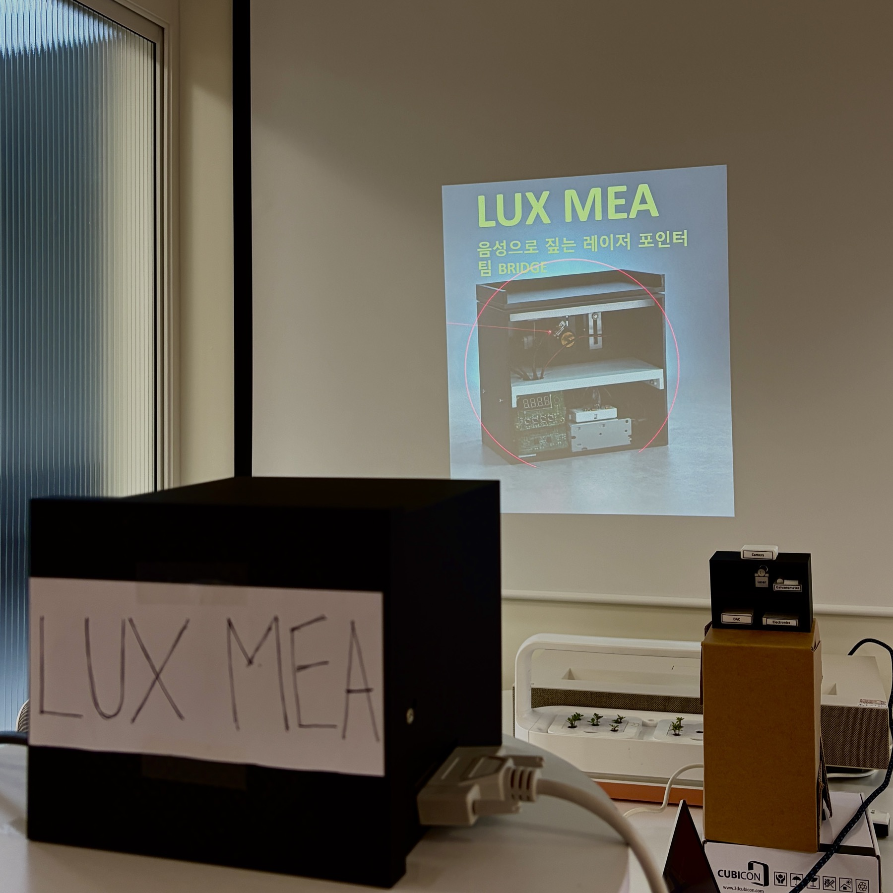
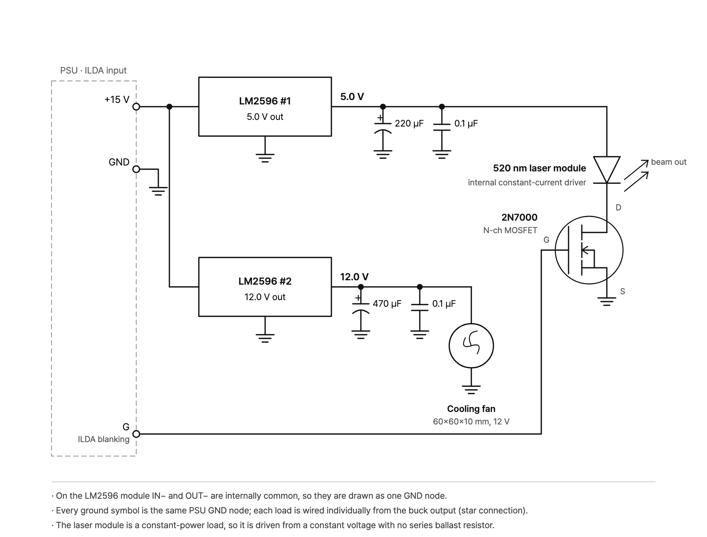
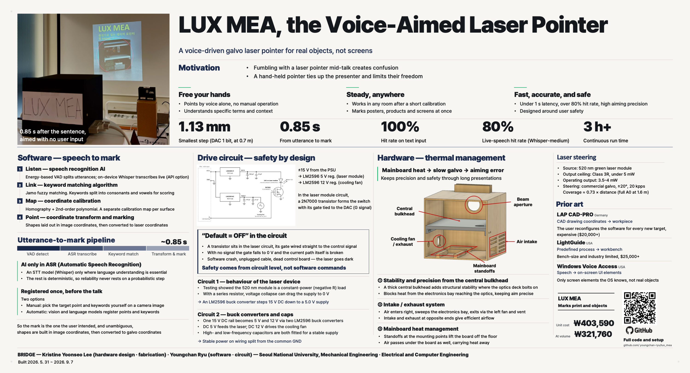

<div align="center">

<h1>LUX MEA</h1>

**Say the name of a part, and a laser points at it.**

A speech-driven galvanometer laser pointer that marks physical objects —
printed posters, circuit boards, machinery — not pixels on a screen.

[](LICENSE)
[](https://www.python.org/)
[-000000.svg?logo=apple&logoColor=white)](#install)
[](#results)
[](https://github.com/Grix/helios_dac)
[](#safety)
[](#results)
[](#results)

**English** · [한국어](README.ko.md)

[Why](#why) · [How it works](#how-it-works) · [Install](#install) · [Usage](#usage) · [Results](#results) · [Safety](#safety) · [Poster](#poster) · [Team](#team)

</div>

<p align="center">
  
</p>

<p align="center"><i>0.85 s after the sentence, aimed with nobody touching anything.</i></p>

---

## Highlights

- **Point by talking.** No pointer to hold, no cursor to drag, no hand raised.
- **Anywhere in the room.** A collimated beam is in focus at every distance, so
  the same beam marks a poster on the wall and a board on the desk and switches
  between them mid-sentence — no refocusing.
- **1.13 mm addressable resolution** at 0.7 m (one DAC LSB), **0.85 s** from
  spoken word to beam on target.
- **One neural network, and only one.** Whisper turns audio into text; every
  step after that is deterministic, because that is the part that has to behave
  in front of an audience.
- **Runs offline.** On-device ASR by default. Cloud is an option, not a
  dependency.
- **Safe by circuit, not by software.** The ceiling is set by a rated Class 3R
  module on a regulated rail, and the beam is off unless a signal turns it on.
- **~₩403,590 (≈US$290) of parts.** Industrial laser projectors that steer a
  beam this way start north of $20,000.

---

## Why

Presenters point at things by hand, and it does not work as well as it looks.
From the side of the room a fingertip lands somewhere else entirely, and on a
dense board a few millimetres is a different component. A laser pointer ties up
a hand and shakes. Zooming a camera onto the object takes the audience's eyes
off the object.

The information needed to point correctly is already in the sentence. LUX MEA
uses the utterance itself as the pointing command, which leaves both hands free
and works for presenters who cannot comfortably raise an arm.

### Prior art

| | input | target | price |
|---|---|---|---|
| **LAP CAD-PRO** (DE) | CAD geometry | workpiece | $20,000+ |
| **LightGuide** (US) | predefined process steps | fixed workbench | $25,000+ |
| **Windows Voice Access** (US) | speech | on-screen UI elements only | — |
| **LUX MEA** | speech | any registered physical surface | **₩403,590** |

Industrial laser projectors steer a beam on exactly this principle, but they
take CAD as input, need software interaction to change target, and are priced
for a factory. Voice control exists too — and stops at the edge of the screen.
LUX MEA is the same steering principle with speech as the input, pointed at the
physical world, for about the price of a laptop.

---

## How it works

```
mic ─▶ VAD ─▶ Whisper ─▶ matcher ─▶ shapes ─▶ calibration map ─▶ galvo ─▶ laser
                            │
                       parts.yaml
```

| stage | what happens | neural? |
|---|---|---|
| **Listen** | energy-based VAD cuts the mic stream into utterances | no |
| **Transcribe** | Whisper, on-device, part names fed in as decoder prompt | **yes — the only one** |
| **Match** | Korean text decomposed to jamo, fuzzy-scored against aliases | no |
| **Aim** | image coordinates → galvo angles via the calibration map | no |
| **Draw** | circle / underline / crosshair, blanked while travelling | no |

**Speech.** An energy-based VAD cuts the microphone stream into utterances,
then Whisper transcribes them on-device — no network. The part names are fed in
as the decoder prompt, which noticeably helps with domain vocabulary.

**Matching.** Korean text is decomposed into jamo before fuzzy matching, so a
transcription error that keeps the consonants still lands on the right part.
Candidates are scored by the summed length of the aliases that matched rather
than by similarity alone; without that, a short generic alias like "power"
matches any long sentence and beats the specific part the speaker meant.

**Calibration.** The galvo only accepts a pair of angles, so a target position
on a surface has to be converted into one. We project a grid of points, film
where they land, and fit a homography plus a 2nd-order polynomial for the
residual distortion. Accuracy is measured on points held out of the fit.

**Rendering.** Shapes are generated in image coordinates and then converted
point by point. Building them in galvo space instead turns circles into
ellipses on any surface that is not square to the beam.

**Two surfaces at once.** A galvo shows one point at a time, but it can revisit
several shapes fast enough that persistence of vision merges them — two shapes
run at well over 100 Hz. Parts joined with `link:` in `parts.yaml` light up
together, so naming a component on the board also marks the paragraph about it
on the poster. The beam is blanked while travelling between them so no
connecting line appears.

### Registration — done once, before the talk

Nothing vision-related runs at showtime. Parts are registered in advance, which
turns *recognition* into *lookup*:

- **Manual** — click the point on a photo, type the aliases.
- **Assisted** — OCR and open-vocabulary detection propose candidates from the
  photo, and a human confirms them. The runtime cannot tell the difference.

---

## Hardware

| | |
|---|---|
| Scanner | commercial galvanometer, ±20°, 20 kpps, double bounce |
| DAC | Helios Laser DAC (12-bit, ILDA) |
| Laser | 520 nm green module, Class 3R, rated ≤5 mW, run at 3.5–4 mW |
| Coverage | width ≈ 0.73 × distance — a full A0 poster from 1.6 m |
| Power | ±15 V PSU → LM2596 buck → 5 V (laser) and 12 V (cooling fan) |
| Blanking | 2N7000 MOSFET in the laser supply, gate driven by the DAC colour channel |
| Camera | calibration and registration only; unplugged during the demo |

<p align="center">
  
</p>

<p align="center"><i>Drive circuit — ±15 V in, two LM2596 rails out, and the blanking transistor on the 5 V leg</i></p>

### "Default = OFF" is a circuit property

The transistor sits in the middle of the laser circuit and its gate is the
control signal. No signal means the gate falls to 0 V and the current path is
physically broken. If the software crashes, the cable falls out, or the control
board dies, the laser goes dark — not because anything decided to turn it off,
but because there is no longer a circuit.

### Thermal design

Mainboard overheating slows galvanometer response, and slow response is aiming
error. The enclosure is built around that: a thick central bulkhead carries the
optical deck and structurally isolates it from the electronics below, intake and
exhaust vents on opposite sides pull air across the electronics bay and out past
the cooling fan, and the mainboard stands on standoffs so air moves under it as
well. Verified for **3 h+ continuous operation**.

---

## Install

Python 3.12 on Apple Silicon is the tested configuration. `--sim` and
`--no-voice` need no hardware at all.

```bash
git clone https://github.com/youngchan-ryu/lux_mea.git
cd lux_mea
python3 -m venv .venv && source .venv/bin/activate
pip install -r requirements.txt
```

Hardware runs need a Helios DAC. `libHeliosLaserDAC.dylib` ships in this
directory and is picked up automatically; set `HELIOS_LIB` only if you keep it
somewhere else. `--engine groq` additionally needs `GROQ_API_KEY`.

## Usage

```bash
python3 test_match.py      # no hardware: checks matching and links
python3 app.py --sim       # no hardware: draws to a window
python3 app.py             # live
```

`app.py --no-voice` gives you number-key control instead of speech, which is
useful while filming or when the room is too loud to trust the microphone.

There is also a small GUI for running it at a booth, where nobody wants to type
flags between demos:

```bash
python3 launcher.py
```

It finds the calibration and dictionary files in the folder, remembers what you
picked, streams the log into the window, and stops the app with SIGINT so the
beam parks on the way out.

Setting up a new object takes four steps — aim, capture, fit, register — which
is what fills `data/`. All of it is in **[MANIFEST.md](MANIFEST.md)**, along
with what every file in here is for.

### Code and data are separate

Everything a session produces or consumes — captures, calibrations, the part
dictionary, logs — lives in `data/` and is not tracked, so a fresh clone has the
code but no calibration. Point `LUXMEA_DATA` somewhere else to keep one folder
per demo object.

---

## Results

| | |
|---|---|
| Utterance → beam on target | **0.85 s** (incl. 0.35 s endpointing) |
| Addressable resolution | **1.13 mm** at 0.7 m (1 DAC LSB) |
| Calibration error (held-out) | ≈ 1 DAC LSB |
| Match accuracy, text in | **100%** |
| End-to-end hit rate, live speech | **80%** (Whisper `medium`) |
| Refresh with two shapes | > 100 Hz |
| Scan rate | 20 kpps |
| Continuous operation | 3 h+ |
| Laser class | 3R, under 5 mW |
| Parts cost | **₩403,590** (₩321,760 at volume) |

### Which Whisper?

We compared three Whisper sizes on recordings of real presentation sentences,
scoring them on *whether the system pointed at the right thing* rather than on
transcription accuracy — the matcher absorbs a lot of ASR error, so word-level
accuracy is the wrong metric.

| model | hit rate | median latency |
|---|---|---|
| large-v3-turbo | 70% / 40% | 0.49 s |
| **medium** | **80% / 80%** | **0.38 s** |
| small | 60% / 70% | 0.14 s |

`medium` won on both accuracy and consistency and is the default. The largest
model was worse and far more variable, mostly because it hallucinated long
repeated phrases on quiet segments — we now drop segments that never rose above
the noise floor rather than sending them to the decoder at all. Raw output is in
[`bench_asr_result.md`](bench_asr_result.md); rerun it with `bench_asr.py`.

Everything above runs locally. `--engine groq` sends audio to a cloud endpoint
instead, which is there for rooms too noisy for the local model; it needs
`GROQ_API_KEY` and, obviously, a network.

---

## Safety

Output stays under 5 mW (Class 3R) because the ceiling is set by parts, not by
code: a module rated Class 3R with its own constant-current driver, fed from an
LM2596 regulated 5.0 V rail rather than a variable one. A series ballast
resistor is not an option here — the green module behaves as a constant-power
load, and a resistor lets the voltage collapse toward 0 V. The blanking
transistor sits in that same supply with its gate on the DAC's colour channel,
so the beam is dark unless something actively turns it on; no signal means no
current path at all. On top of that, every coordinate is clamped to a measured
safe region (`device.yaml`) before it reaches the DAC, so a software bug cannot
steer the beam outside the envelope that was tested. The beam parks into a dump
when idle.

> Software does not guarantee safety here. The hardware sets the floor;
> software adds accuracy and convenience on top of it.

---

## Limitations

- One calibration is one surface. Different depth or tilt means a separate fit;
  the map bends at the boundary and a single homography cannot express it.
- Anchors are tied to the camera pose used during registration. Move the camera
  and they have to be redone.
- The mockup is treated as a plane. Parts standing proud of that plane are off
  by roughly their height times the tangent of the incidence angle.
- Registration is manual clicking. OCR and detection can propose candidates,
  but a human still checks them, and nothing vision-related runs at showtime.

## Roadmap

- [x] Galvo and laser drive, hardware blanking
- [x] Planar calibration (homography + 2nd-order polynomial)
- [x] Speech recognition → part matching
- [x] Two surfaces from one beam (poster ↔ object)
- [x] Booth GUI, switchable ASR backends
- [x] 520 nm green laser (LM2596 buck — constant-power load, cannot be resistor-driven)
- [x] Active cooling, 3 h+ verified
- [ ] Wire the assisted-registration pipeline into the GUI
- [ ] Marker-based drift monitoring during a talk
- [ ] Assembly-guide mode (detect a fitted part → mark the next step)

---

## Poster

Exhibited at the 15th SNU College of Engineering Creative Design Festival,
9–10 September 2026.

<p align="center">
  <a href="docs/poster_en.png"></a>
</p>

<p align="center">
  <a href="docs/poster_en.png">Full resolution</a> &nbsp;·&nbsp;
  <a href="docs/poster_kr.png">한국어 edition</a>
</p>

---

## Team

**Team BRIDGE** — Seoul National University · 31 May 2026 – 7 September 2026

| | | |
|---|---|---|
| **Kristine Yoonseo Lee** | hardware design and fabrication | Mechanical Engineering |
| **Youngchan Ryu** | software and drive circuit | Electrical and Computer Engineering |

## References

- LAP GmbH, *CAD-PRO Laser Projector — Product Documentation*, 2024.
- IEC 60825-1:2014, *Safety of Laser Products — Part 1*.
- A. Radford et al., *Robust Speech Recognition via Large-Scale Weak
  Supervision*, arXiv:2212.04356, 2022.

## License

[MIT](LICENSE). The bundled Helios DAC host library is MIT-licensed by Gitle
Mikkelsen — see [NOTICE](NOTICE).
